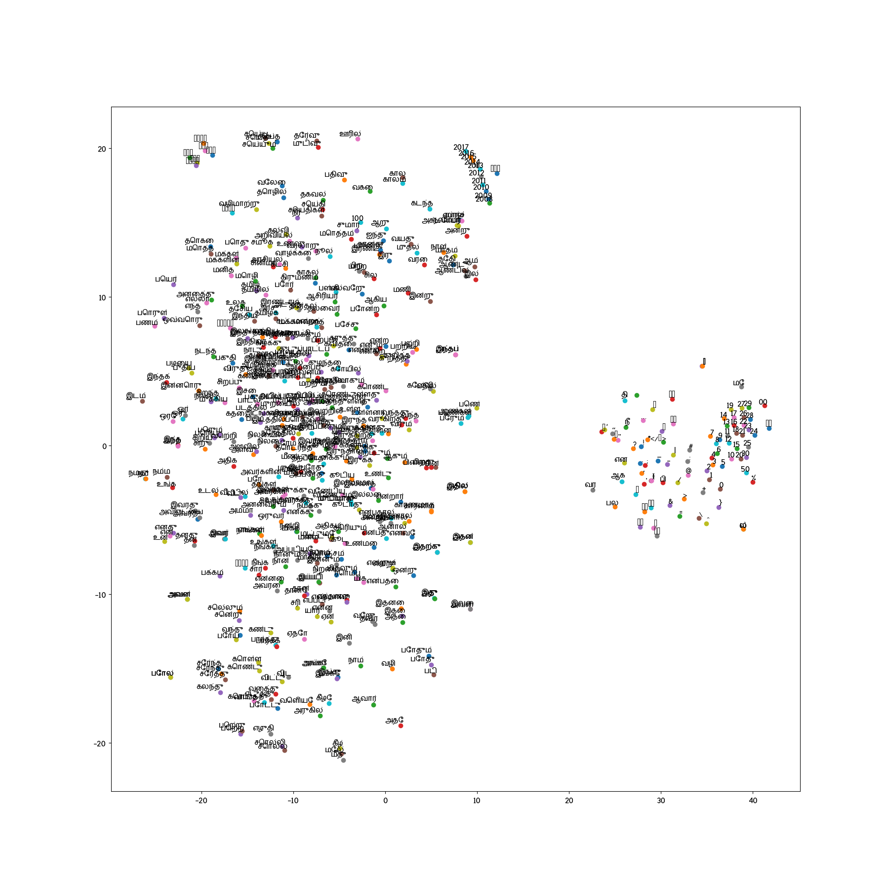
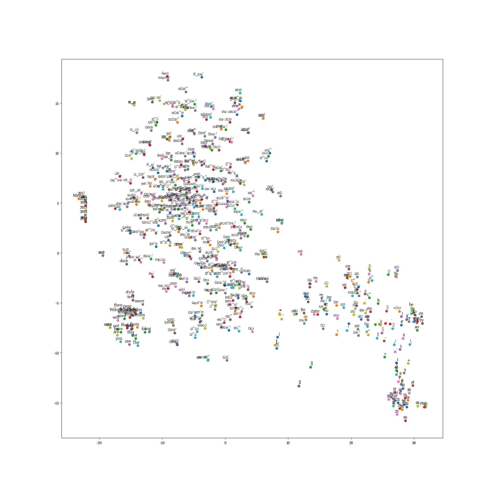

# FastText
Facebook's fasttext

# t-SNE (t-Distributed Stochastic Neighbouring Embedding)

dimensionality reduction algorithm which is used to visualize high dimensional data, such as word vectors. You can’t plot 300 dimensional data on a X-Y plane, you have to reduce the dimensions to do that. Luckily, t-SNE serves the purpose.

Configure fasttext pretrained models file location in plot_tsne.py

Limited the visualization to 500 words only. You may change this parameter to view more or less words.

# Tamil 

# Sinhala
