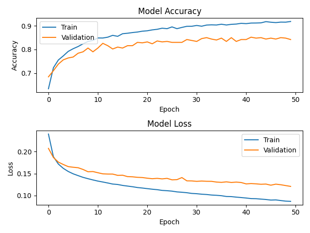
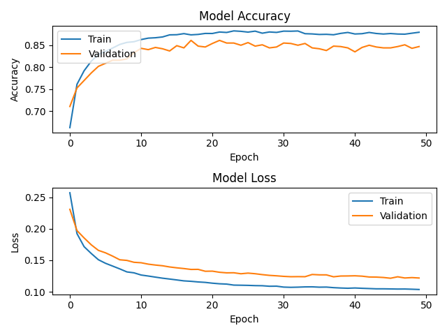

# Deep learning based short sentence similarity for Tamil/Sinhala languages
This research focuses on finding the best possible deep-learning based techniques to measure the short sentence similarity for low-resourced languages, focusing on Tamil and Sinhala short sentences by utilizing existing techniques available for English.

This approach using Siamese neural networks and LSTM with Manhattan distance for detecting semantic similarity between short sentence pairs in Tamil, Sinhala languages. 
Training dataset used:
  * Sinhala 5k short sentence pairs
  * Tamil 2.5K short sentence pairs
  
Please follow the INSTALL.md guide for prerequisites & installing required dependencies.

## The Results

###Sinhala
This experiment tried out with various parameters such as number of hidden states of LSTM cell, activation function of LSTM cell and repeated count of epochs.
here, we used Intel(R) Core(TM) i5-7200U CPU @ 2.50GHz 2.70 GHz and 16GB RAM for training and 10% data was used as the validation set(batch size=64).
As a result, I have reached about 91.44% training accuracy & 86.79% accuracy after 50 epochs about 16 mins later.

```
282/282 [==============================] - 8s 27ms/step - loss: 0.0630 - accuracy: 0.9144 - val_loss: 0.1090 - val_accuracy: 0.8679
Training time finished.
50 epochs in       985.85
0.8679(max: 0.8700)
```

# Sinhala



###Tamil
This experiment tried out with various parameters such as number of hidden states of LSTM cell, activation function of LSTM cell and repeated count of epochs.
here, we used Intel(R) Core(TM) i5-7200U CPU @ 2.50GHz 2.70 GHz and 16GB RAM for training and 10% data was used as the validation set(batch size=32).
As a result, I have reached about 86.53% training accuracy & 83.90% accuracy after 100 epochs about 21 mins later.

```
165/165 [==============================] - 6s 35ms/step - loss: 0.1001 - accuracy: 0.8653 - val_loss: 0.1269 - val_accuracy: 0.8390
Training time finished.
100 epochs in       481.67
0.8390(max: 0.8561)
```

# Tamil 

